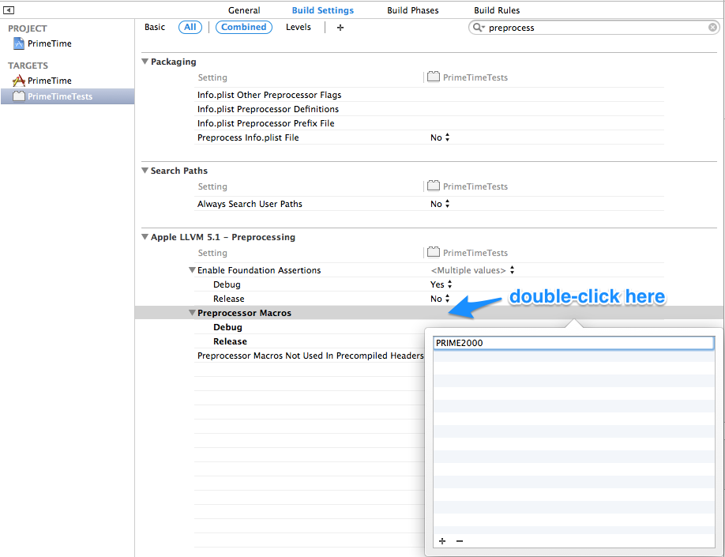

##Goal

Understanding some of the performance characteristics of `UITableView`

## Instructions

**Don't just google the answer to finding primes!! Try and actually solve it**

  1. First create a function `primeNumber:(NSInteger)prime` that will generate the `prime`th prime number. So if you passed in 5 it would return 11 because that is the 5th prime. If you put in 386 then you would get 2,663. Remember a prime number is a number that is only divisible by 1 and itself. To figure out if something is evenly divisible the "modulus" should equal 0. Modulus is the remainder from division, it's symbol is %. So, `5 % 3 = 2`, `5 % 5 = 0`, `5 % 4 = 1` and `5 % 1 = 0`
  2. Now create a `UITableView` and make each cell's contents equal to that row numbers prime number. So row number 5 should have 11 in it and row number 386 should have 2663.
- programmatically set your uitableview's accessibility identifier to 'table'
- you should have 100 tableview cells
  3. To prepare for the next step, go to your test target, called PrimeTimeTests, and find build settings. type 'preprocessor macros' into the search bar on the upper right, and double click the blank line next to 'Preprocessor Macros' and add 'PRIME2000'

  3. Generating prime numbers actually takes a pretty long time, but the iOS simulator is running on your super fast laptop! So let's make it a bit harder. Add 2000 to the row number every time. So the 1st row should display the 2001th prime number, which is 17393. Do you notice any slowness?
  3. For the next step, change your preprocessor macros to say only 'PRIME5000'
  4. Now let's go even further. Add 5000, or 50000 to the row. Now do you notice any slowness? You will if you are calculating all of the prime numbers in your `tableview:cellForRowAtIndexPath:` method.
  5. Figure out a way to be able to display prime numbers 5000 through 5100 without any slowness in scrolling.

## Hints

There is another type of loop called a `while` loop that will continue to run as long as some condition is still met. This may be useful in finding primes. [link for more info](https://mobileappmastery.com/objective-c-loops/)
